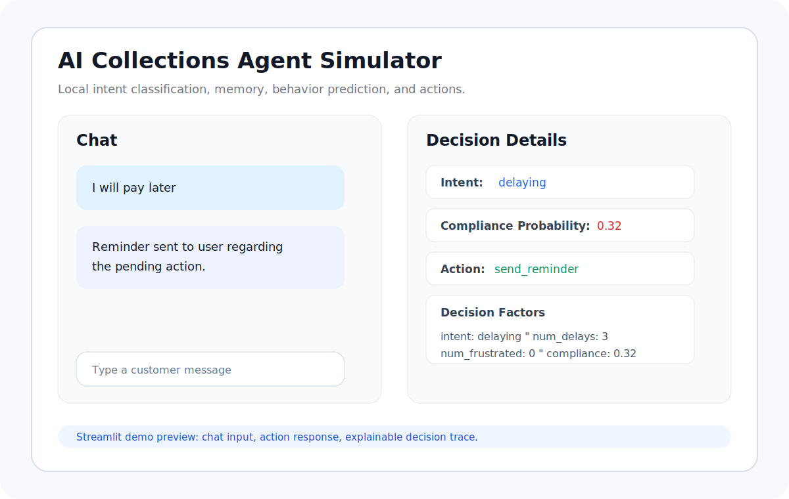
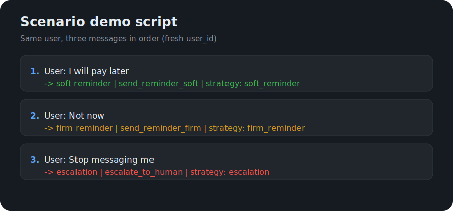

# AI Collections Agent Simulator

A local AI agent system that models user interactions, predicts behavior, and makes real-time decisions using intent detection, memory, and machine learning.

## Problem Statement

Real-world AI systems in fintech and support cannot rely on one-off message classification alone. They need to:

* Understand what a user is asking for
* Track behavior across interactions
* Predict likely outcomes
* Choose the next action dynamically

This project models that workflow in a fully local environment. It combines intent detection, persistent memory, behavioral prediction, explainable decision rules, and simulated actions without relying on external services.

## System Overview

```text
User Input
-> Intent Classification (rule-based + sentiment)
-> Memory (SQLite interaction history)
-> Behavior Prediction (Logistic Regression)
-> Decision Engine (rule-based reasoning)
-> Strategy State (adaptive reminders / escalation)
-> Action Handler (simulated system actions)
-> Response (CLI / Streamlit UI)
```

The result is a small but complete agent loop.

Each message is classified, stored, analyzed against user history, scored for compliance likelihood, routed through a decision engine, and converted into a concrete system response.

## Demo

Run the Streamlit app to interact with the AI agent and view decision-making in real time.

The UI uses a **dark theme** by default via `.streamlit/config.toml` when you run Streamlit from the project root.

### Screenshots (reference previews)

Light layout reference (original wireframe-style preview):



Dark-themed UI preview (matches GitHub-inspired dark palette used in config):


When you have captures from your machine, replace the `.svg` paths above with real `.png` screenshots (same filenames work if you keep paths unchanged).

Scenario flow (three-turn escalation script):



## Scenario Demo Script

Use a **fresh User ID** in the Streamlit app (top text field) or a new SQLite file so delay counts start at zero. Send these three messages **in order** for the same user:

```text
User: I will pay later
→ soft reminder (action: send_reminder_soft, strategy: soft_reminder)

User: Not now
→ firm reminder (action: send_reminder_firm, strategy: firm_reminder)

User: Stop messaging me
→ escalation (action: escalate_to_human, strategy: escalation)
```

Verified against the local pipeline: message 1 and 2 classify as `delaying` (second turn triggers the firm reminder path), message 3 classifies as `frustrated` and escalates when compliance probability is below the engine threshold.

## Architecture

| Module | Responsibility |
| ------ | -------------- |
| `intent_classifier.py` | Detects user intent and sentiment signals from local rule-based scoring. |
| `memory_manager.py` | Persists user interaction history in SQLite. |
| `behavior_model.py` | Trains a local logistic regression model and predicts compliance probability. |
| `decision_engine.py` | Selects actions using intent, behavior signals, and compliance probability. |
| `action_handler.py` | Simulates system actions such as reminders, human escalation, and user assistance. |
| `agent_orchestrator.py` | Controls the full pipeline from message input to final response. |
| `streamlit_app.py` | Provides an interactive chat UI with decision details and trace output. |

## Example Scenario

```text
Input: "I will pay later"
Intent: delaying
Compliance: 0.32
Strategy: firm_reminder
Action: send_reminder_firm
Reason: repeated delay behavior with low compliance probability
Outcome: user responded but delayed again
```

## Key Features

* Intent classification with sentiment awareness
* Persistent memory using SQLite
* Behavioral prediction using machine learning
* Decision-making engine for action selection
* Adaptive strategy state for repeated behavior
* Explainable reasoning and trace outputs
* Interactive UI using Streamlit
* Local-first architecture with no external APIs

## Observability (lightweight)

The SQLite database keeps **running counters** (per DB file) for **reminder actions** (soft, firm, or legacy `send_reminder`) and **escalations** (`escalate_to_human`). The CLI and Streamlit footer surface the latest totals so you can sanity-check volume the same way you might glance at metrics in a real system.

## Robustness

If **intent classifier confidence** falls below **0.35**, the orchestrator **skips specialized routing** and returns a **standard response** with an explicit reason, instead of forcing a delay or frustration branch on a weak match.

## Adaptive Behavior

The agent updates its strategy as user behavior changes over time:

* First delay: `soft_reminder`
* Second delay: `firm_reminder`
* Third delay: `escalation`

Repeated delays move the user from reminders toward escalation, while low-compliance frustrated messages can escalate immediately.

After each action, the system also simulates a simple outcome. For example, a soft reminder may produce `user did not respond`, while escalation produces `case forwarded to human agent`. This creates a lightweight feedback loop that makes the demo feel closer to a real multi-turn agent workflow.

## Design Decisions

**Rule-based intent first:** The intent layer is deterministic, fast, and easy to inspect. For a simulator, transparent behavior is more valuable than opaque classification.

**Logistic regression for behavior prediction:** Compliance prediction uses a lightweight model that trains quickly on synthetic data, exposes meaningful probabilities, and stays easy to reason about.

**SQLite for memory:** SQLite keeps the system local, persistent, and simple to run. It also mirrors the core requirement of tracking user behavior over time without needing infrastructure.

**Modular architecture:** Intent classification, memory, prediction, decisions, actions, orchestration, and UI are separated so each part can evolve independently.

## How to Run

Install dependencies:

```bash
pip install -r requirements.txt
```

Run the interactive UI:

```bash
streamlit run streamlit_app.py
```

Run the CLI:

```bash
python -m ai_agent_simulator.app
```

Use a custom user or memory database:

```bash
python -m ai_agent_simulator.app --user-id alice --db ./memory.db
```
